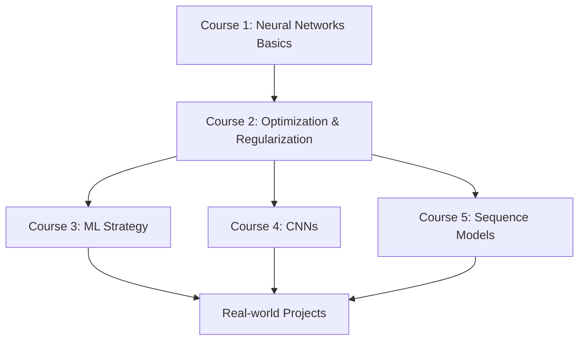

# Deep Learning Specialization - Learning Repository

A comprehensive learning repository for the Deep Learning Specialization by Andrew Ng. This repository contains structured notes, lab implementations, experiments, and reusable utilities covering neural networks, optimization, CNNs, sequence models, and practical PyTorch workflows.

## 🎯 Goals

- **Structured Learning**: Organized course materials and notes for easy reference
- **Hands-on Practice**: Practical implementations and lab exercises
- **Experimentation**: Platform for testing new ideas and techniques
- **Code Reusability**: Modular utilities for rapid prototyping
- **Long-term Reference**: Comprehensive archive of deep learning concepts

## 📁 Repository Structure

```
deep-learning-specialization-notes/
├── notes/               # Course notes and theoretical concepts
│   ├── course1-neural-networks/
│   ├── course2-optimization/
│   ├── course3-ml-projects/
│   ├── course4-cnns/
│   ├── course5-sequences/
│   └── note_template.md
│
├── labs/                # Lab implementations and exercises
│   ├── course1-neural-networks/
│   ├── course2-optimization/
│   ├── course3-ml-projects/
│   ├── course4-cnns/
│   ├── course5-sequences/
│   ├── lab_template.ipynb
│   └── pytorch_example.py
│
├── experiments/         # Custom experiments and explorations
│   └── experiment_template.md
│
├── utils/              # Reusable utility modules
│   ├── __init__.py
│   ├── data_utils.py
│   ├── model_utils.py
│   ├── training_utils.py
│   └── visualization_utils.py
│
├── requirements.txt    # Python dependencies
├── LICENSE            # MIT License
└── README.md          # This file
```

## 🚀 Getting Started

### Prerequisites

- Python 3.8 or higher
- pip package manager
- (Optional) CUDA-capable GPU for faster training

### Installation

1. **Clone the repository:**
   ```bash
   git clone https://github.com/artiordex/deep-learning-specialization-notes.git
   cd deep-learning-specialization-notes
   ```

2. **Create a virtual environment (recommended):**
   ```bash
   python -m venv venv
   source venv/bin/activate  # On Windows: venv\Scripts\activate
   ```

3. **Install dependencies:**
   ```bash
   pip install -r requirements.txt
   ```

4. **Verify installation:**
   ```bash
   python labs/pytorch_example.py
   ```

### Running Jupyter Notebooks

Start Jupyter and open any lab notebook:
```bash
jupyter notebook
```

Navigate to `labs/` and open any `.ipynb` file to start learning!

## 📚 Course Structure

### Course 1: Neural Networks and Deep Learning
- Week 1: Introduction to deep learning
- Week 2: Neural network basics
- Week 3: Shallow neural networks
- Week 4: Deep neural networks

### Course 2: Improving Deep Neural Networks
- Week 1: Practical aspects of deep learning
- Week 2: Optimization algorithms
- Week 3: Hyperparameter tuning and regularization

### Course 3: Structuring Machine Learning Projects
- Week 1: ML strategy (1)
- Week 2: ML strategy (2)

### Course 4: Convolutional Neural Networks
- Week 1: Foundations of CNNs
- Week 2: Deep convolutional models
- Week 3: Object detection
- Week 4: Face recognition and neural style transfer

### Course 5: Sequence Models
- Week 1: Recurrent Neural Networks
- Week 2: Natural Language Processing & Word Embeddings
- Week 3: Sequence models & Attention mechanism

## 🛠️ Using the Utilities

The `utils/` directory contains helper modules for common tasks:

### Data Utilities
```python
from utils import normalize_data, train_test_split

# Normalize your data
normalized_data = normalize_data(raw_data)

# Split into train/test sets
X_train, X_test, y_train, y_test = train_test_split(X, y, test_size=0.2)
```

### Model Utilities
```python
from utils import count_parameters, save_checkpoint

# Count model parameters
param_count = count_parameters(model)
print(f"Model has {param_count:,} parameters")

# Save model checkpoint
save_checkpoint(model, optimizer, epoch=10, loss=0.5, path='checkpoints/model.pt')
```

### Training Utilities
```python
from utils import train_model

# Complete training loop with validation
history = train_model(
    model, train_loader, val_loader,
    criterion, optimizer, epochs=10,
    device='cuda', save_best=True
)
```

### Visualization Utilities
```python
from utils import plot_training_curves, plot_confusion_matrix

# Plot training history
plot_training_curves(history, save_path='results/training.png')

# Plot confusion matrix
plot_confusion_matrix(cm, class_names=['cat', 'dog'], save_path='results/cm.png')
```

## 🔬 Running Experiments

1. **Create a new experiment directory:**
   ```bash
   mkdir experiments/my_experiment
   ```

2. **Copy the experiment template:**
   ```bash
   cp experiments/experiment_template.md experiments/my_experiment/experiment.md
   ```

3. **Fill in the template** with your hypothesis, methodology, and results

4. **Implement and document** your experiment

See `experiments/README.md` for more details on experiment structure and best practices.

## 📝 Creating Notes

1. **Create a note file** in the appropriate course directory:
   ```bash
   cp notes/note_template.md notes/course1-neural-networks/gradient_descent.md
   ```

2. **Fill in the sections** with concepts, formulas, and explanations

3. **Link related concepts** for easy navigation

See `notes/README.md` for note-taking guidelines.

## 🧪 Example Workflow

Here's a typical workflow for learning a new concept:

1. **Study** the course material
2. **Take notes** using the note template
3. **Implement** the concept in a lab notebook
4. **Experiment** with variations and improvements
5. **Document** findings and insights
6. **Share** or review with peers

## 🤝 Contributing

This is a personal learning repository, but feel free to:
- Fork and adapt for your own learning
- Suggest improvements via issues
- Share your own implementations

## 📄 License

This project is licensed under the MIT License - see the [LICENSE](LICENSE) file for details.

## 🙏 Acknowledgments

- **Andrew Ng** and the team at DeepLearning.AI for the excellent course content
- **PyTorch** team for the amazing deep learning framework
- The broader **ML/AI community** for continuous inspiration

## 📞 Contact

For questions or discussions:
- Open an issue in this repository
- Connect via GitHub: [@artiordex](https://github.com/artiordex)

## 🗺️ Learning Path



## 📊 Progress Tracking

Use this checklist to track your progress:

- [ ] Course 1: Neural Networks and Deep Learning
  - [ ] Week 1: Introduction
  - [ ] Week 2: Neural Network Basics
  - [ ] Week 3: Shallow Neural Networks
  - [ ] Week 4: Deep Neural Networks

- [ ] Course 2: Improving Deep Neural Networks
  - [ ] Week 1: Practical Aspects
  - [ ] Week 2: Optimization Algorithms
  - [ ] Week 3: Hyperparameter Tuning

- [ ] Course 3: Structuring ML Projects
  - [ ] Week 1: ML Strategy (1)
  - [ ] Week 2: ML Strategy (2)

- [ ] Course 4: Convolutional Neural Networks
  - [ ] Week 1: CNN Foundations
  - [ ] Week 2: Deep CNNs
  - [ ] Week 3: Object Detection
  - [ ] Week 4: Special Applications

- [ ] Course 5: Sequence Models
  - [ ] Week 1: RNNs
  - [ ] Week 2: NLP & Word Embeddings
  - [ ] Week 3: Sequence Models & Attention

---

**Happy Learning! 🚀🧠**
